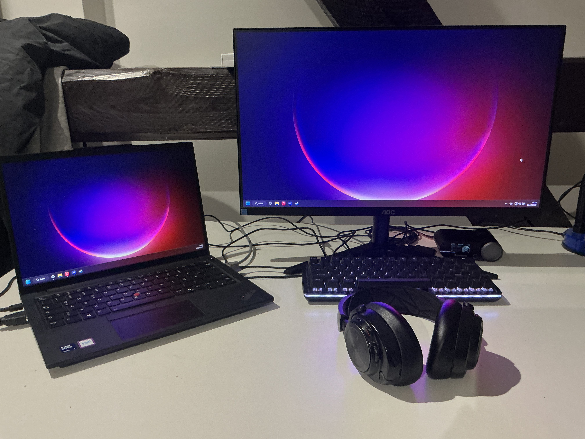
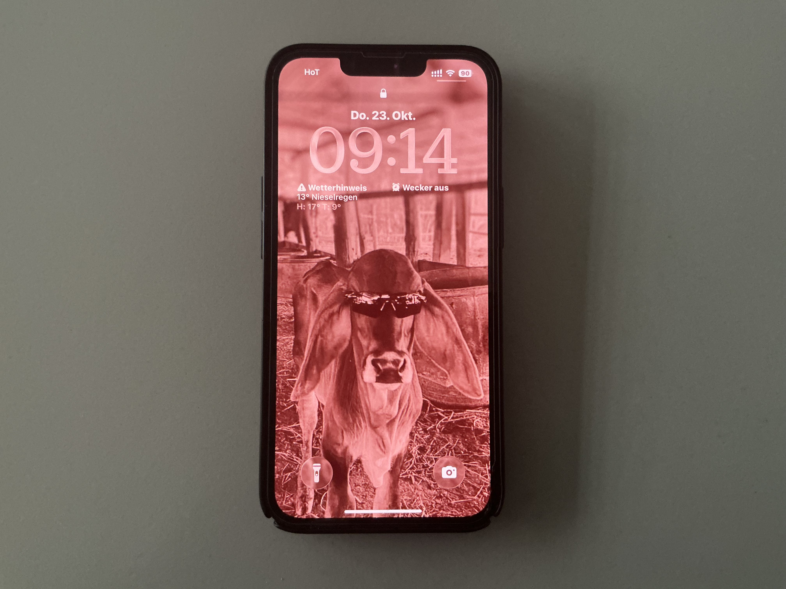
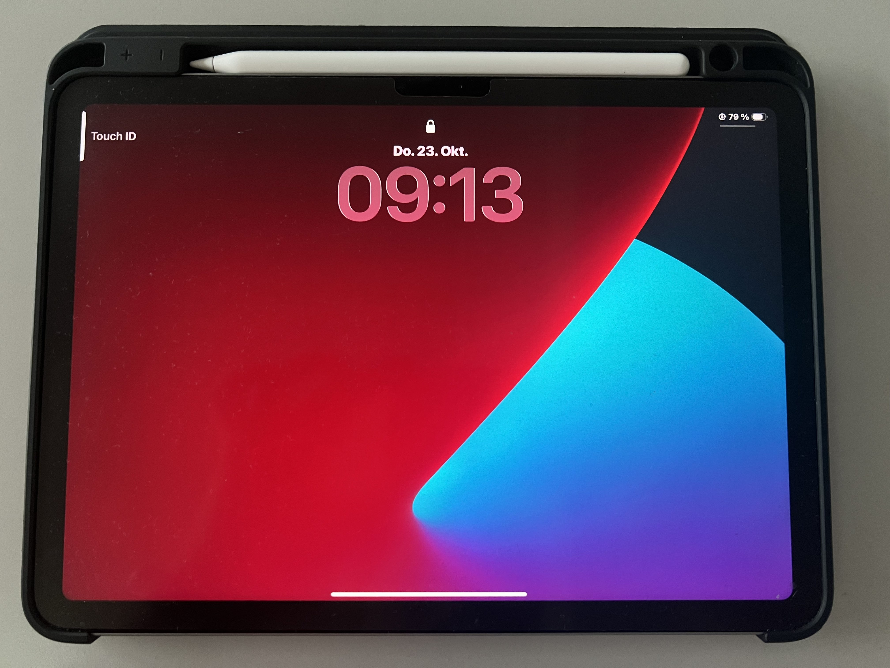

# Personal CO2 Footprint

**Lenovo Thinkpad T14 Gen 5 (connected to Mouse, Keyboard, Monitor and Headset)**

- Lenovo ThinkPad T14 Gen 5: 45-65W
  - AOC 1920x1080 60Hz monitor: 20-30W
  - Backlit keyboard: 2-5W
  - SteelSeries Arctis Pro Wireless headset with base station: 2.5W
  - Logitech Superlight 2 mouse: 0.1-0.5W
 
- Use time approx.: 8 hours Daily

**iPhone 13 Pro**

- iPhone 13 Pro (charging/using): 5-20W depending on state
 
- Use time approx.: 4 hours Daily

**iPad Air M2**

- iPad Air M2: 10-20W
 
- Use time approx.: 4 hours Daily

## Battery Energy and Daily Consumption Calculations

**iPhone 13 Pro:**

\[
\text{Wh} = \frac{3095 \text{ mAh} \times 3.83 \text{ V}}{1000} \approx 11.85 \text{ Wh}
\]

\[
\text{kWh} = \frac{11.85 \text{ Wh}}{1000} = 0.01185 \text{ kWh}
\]

Estimated daily energy consumption based on use hours:

- For 4 hours of use:  
\[
11.85 \times \frac{4}{24} = 11.85 \times 0.1667 \approx 1.975 \text{ Wh}
\]

**iPad Air M2:**

\[
\text{Wh} = \frac{7606 \text{ mAh} \times 3.83 \text{ V}}{1000} \approx 29.13 \text{ Wh}
\]

\[
\text{kWh} = \frac{29.13 \text{ Wh}}{1000} = 0.02913 \text{ kWh}
\]

Estimated daily energy consumption based on use hours:

- For 4 hours of use:  
  \[
  29.13 \times \frac{4}{24} \approx 4.85 \text{ Wh}
  \]

## Table of Energy Consumption

| Device                          | Time Scale (h) | Active Power (W) | Idle Power (W) | kWh per Hour (Active) | kWh per Day (Active) | kWh per Week (Active) | kWh per Year (Active) |
|--------------------------------|----------------|------------------|----------------|----------------------|---------------------|----------------------|----------------------|
| Lenovo ThinkPad T14 Gen 5       | 8              | 45 - 65          | ~1.2           | 0.045 - 0.065        | 0.36 - 0.52         | 2.52 - 3.64          | 131.4 - 189.8        |
| AOC 1920x1080 60Hz Monitor      | 8              | 20 - 30          | ~0.5           | 0.02 - 0.03          | 0.16 - 0.24         | 1.12 - 1.68          | 58.4 - 87.6          |
| Backlit Keyboard                | 8              | 2 - 5            | ~0             | 0.002 - 0.005        | 0.016 - 0.04        | 0.112 - 0.28         | 5.84 - 10.2          |
| SteelSeries Arctis Pro Wireless | 8              | ~2.5             | ~0.1           | 0.0025               | 0.02                | 0.14                 | 7.3                  |
| Logitech Superlight 2 Mouse     | 8              | 0.1 - 0.5        | 0              | 0.0001 - 0.0005      | 0.0008 - 0.004      | 0.0056 - 0.028       | 0.29 - 1.46          |
| iPhone 13 Pro (charging/usage)  | 4              | 5 - 20           | ~0             | 0.005 - 0.02         | 0.02 - 0.08         | 0.14 - 0.56          | 7.3 - 29.2           |
| iPad Air M2                    | 4              | 10 - 20          | ~0             | 0.01 - 0.02          | 0.04 - 0.08         | 0.28 - 0.56          | 14.6 - 29.2          |

## Reflections

Looking at the numbers, the Lenovo ThinkPad T14 Gen 5 uses the most energy overall due to its higher power draw and longer daily use time. The AOC monitor and backlit keyboard also contribute noticeably, but much less than the laptop itself. The iPad Air M2, despite having a significantly larger battery capacity than the iPhone 13 Pro, uses more power mainly due to its longer use time and bigger screen. The iPhone 13 Pro is the most energy-efficient device here, consuming the least energy overall, which fits well with its smaller battery and typical use pattern. Devices like the SteelSeries wireless headset and Logitech mouse have minimal power consumption, reflecting their limited role and short active duty cycles.

This comparison highlights how both power draw and how long a device is used or stays on greatly influence total energy consumption. Bigger, more powerful devices naturally use more energy, but shorter use times or efficient power management can help balance their impact.